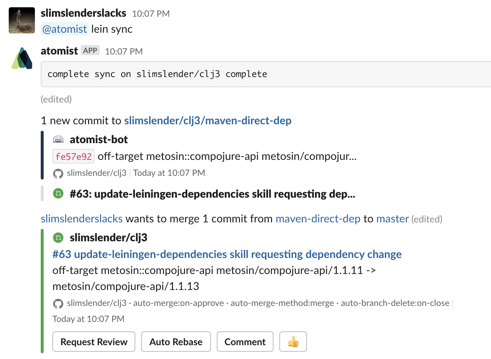

# `atomist/update-leiningen-dependencies`

Track `project.clj` dependencies across different projects.

<!---atomist-skill-readme:start--->

Keep track of all versions of  dependencies found within `project.clj` files across your Repositories.

# What it's useful for

Track all the different versions of library references in `project.clj` files across your repositories.  
Automatically raise pull requests when a version does not conform to a selected target version.  Choose
from three different targets:

*  **Latest Used** - select the latest version found in one of your repositories
*  **Latest Available** - select the latest version found at [clojars](https://clojars.org)
*  **Manual** - manually select a target version in a skill configuration

# Before you get started

Connect and configure these integrations:

1. **GitHub**
2. **Slack** (optional)

The **GitHub** integration must be configured in order to use this skill. 
At least one repository must be selected. We recommend connecting the **Slack** integration.

When the optional Slack integration is enabled, users can interact with this skill directly from Slack.

# How to configure

You can enable this skill without configuring any target versions.  In this mode, the skill will collect
data about your library versions, but will take no action.  Simply select the set of
repositories that should be scanned.    

1. **Select dependency target policy, optional policy configuration** 
    
    A `Manual` policy requires that you specify both the library and the version.

    

    The other two policies require only the names of the libraries that should be kept up to date.

    

2. **Determine repository scope**

    

    By default, this skill will be enabled for all repositories in all organizations you have connected.

    To restrict the organizations or specific repositories on which the skill will run, you can explicitly choose 
    organization(s) and repositories.

## How to use Update Leiningen Dependencies

1.  **Configure the skill, add a target policy and select repositories to scan for `project.clj` files** 

    The skill will run on any new pushes to selected repositories.
    and will raise pull requests for npm libraries that are not on the target.
    
    
   

2.  **Run a version sync from Slack**

    Interactively check that a repository is in sync with current policies. 

    ```
    @atomist lein sync
    @atomist lein sync --slug=org/repo
    ```

    (you do not need to specify a `--slug` parameter if your Slack channel is linked to a repository)

    
    
    
    This is useful when you want to raise a pull request without having to wait for a push to occur.

3.  ** Enjoy an easier way to keep your dependencies as current as you want them to be**

To create feature requests or bug reports, create an [issue in the repository for this skill](https://github.com/atomist-skills/update-leiningen-dependencies-skill/issues). See the [code](https://github.com/atomist-skills/update-leiningen-dependencies-skill) for the skill.

<!---atomist-skill-readme:end--->

## Building and Testing

We should be able to invoke everything from `npm`.  Our shadow-cljs configuration uses deps.edn of course so there's 
a lot of JVM processing happening as well.

```
$ npm ci
$ npm run test
```

---

Created by [Atomist][atomist].
Need Help?  [Join our Slack workspace][slack].

[atomist]: https://atomist.com/ (Atomist - How Teams Deliver Software)
[slack]: https://join.atomist.com/ (Atomist Community Slack) 
